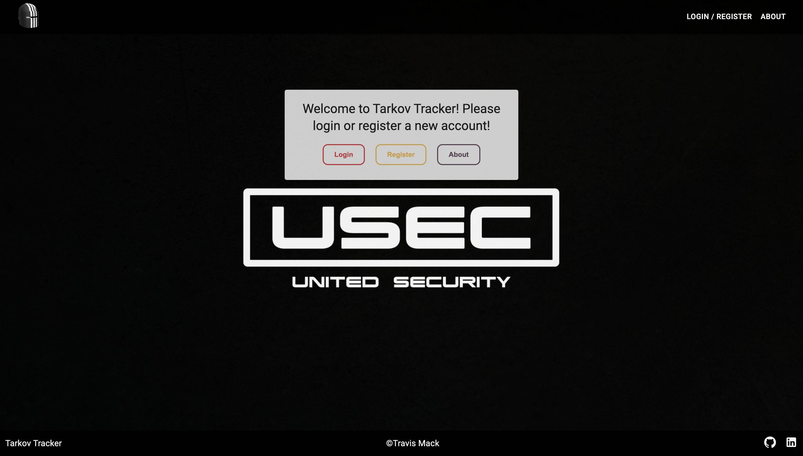
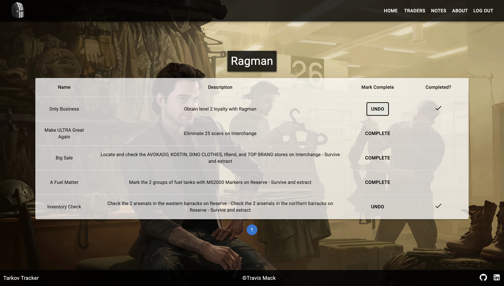
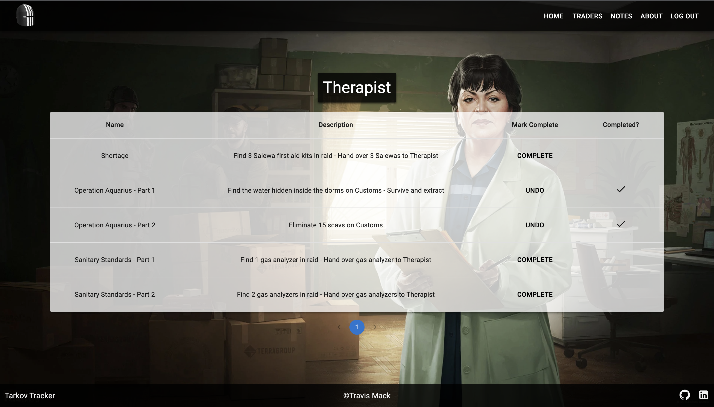

# Tarkov Tracker

## Description
Tarkov Tracker is an app that allows users to keep track of their in-game quest progress related to the first-person shooter game Escape From Tarkov, available to play on PC. Once a user creates an account, they can go through the various trader pages and mark off any quests they have completed in-game related to that trader. There is also a notes page that allows users to keep track of any extra goals they have while playing or just notes in general related to Tarkov.

## Screenshots Of The App
   

### Prerequisites
- [Node.js](https://nodejs.org/en/)

## Installation
1. Create a database named `prime_app`,
2. The queries in the `database.sql` file are set up to create all the necessary tables and populate the needed data to allow the application to run correctly. The project is built on [Postgres](https://www.postgresql.org/download/), so you will need to make sure to have that installed. We recommend using Postico to run those queries as that was used to create the queries, 
3. Open up your editor of choice and run an `npm install`
4. Run `npm run server` in your terminal
5. Run `npm run client` in your terminal
6. The `npm run client` command will open up a new browser tab for you!

## Built With
- JavaScript
- CSS
- MaterialUI
- node.js
- Express
- React
- Redux
- PostgresQL
- moment.js
- fly.io

## Acknowledgement
Thanks to Blaine, Mason, and Katie at Emerging Digital Academy for always being there for technical help and general support whenever we needed it.

## Support
For any further questions on the app, feel free to email me at travismack47@protonmail.com